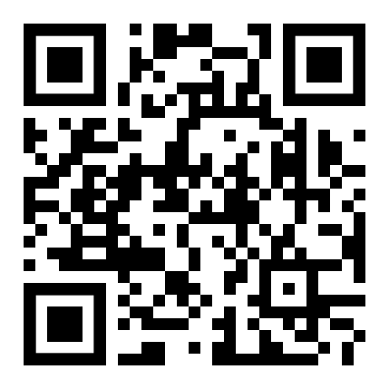

# Donate

We persist in advocating for a development model reliant on voluntary contributions and donations. 

Our diverse array of research, projects development and tools production is fueled by people who care about digital privacy, and we hope to keep it real like this, with your support and vibrant help of the community.

Anyone can donate ETH and ERC-20 tokens to the following addresses and networks:

| Network | Address | |
| --- | --- | --- |
| Ethereum (mainnet) | `0x50927852076a6c93177E25e906d706981Af9e27A` | [Etherscan](https://etherscan.io/address/0x50927852076a6c93177E25e906d706981Af9e27A) |
| Arbitrum One | `0x50927852076a6c93177E25e906d706981Af9e27A` | [Arbiscan](https://arbiscan.io/address/0x50927852076a6c93177E25e906d706981Af9e27A) |

Funds sent to the above address will be held in the [Web3Privacy Now multisig](/core-team/multisig) and used to boost development of our projects.