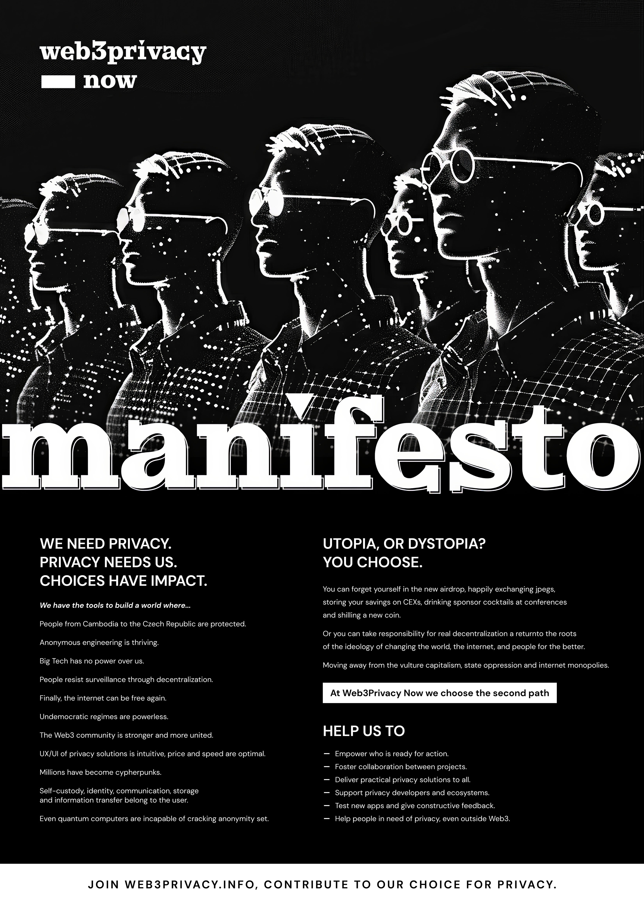
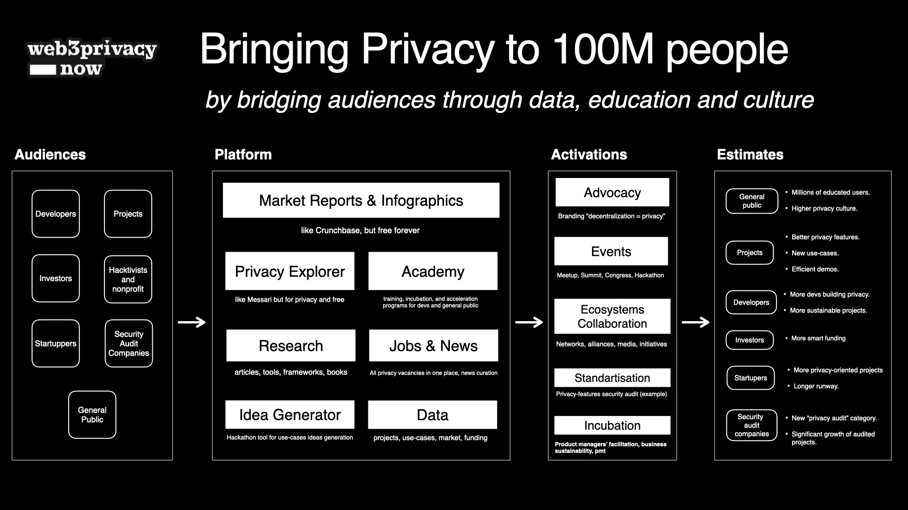

## We aim to drive profound social and political change by advocating Privacy in the Web3 Era.

Through unified efforts, we are paving the way for a more equitable, decentralized, and freedom-respecting digital commons.

## The Challenge: Equal Empowerment of Privacy

In a world where connected humans are unknowingly commodified and surveilled, urgent change is needed.

The Web3 stack promotes data, privacy, and security awareness, acting as a lifelong educational partner for everyone.

We produce and curate knowledge to empower individuals restoring their agency in our hyperconnected reality.

## Our Approach: Advocacy + Collaboration + Tooling

**Advocacy** 
- Facilitate education through master classes, frameworks, lectures, and guides tailored for both the general public and technical audiences.
- Lay the groundwork for the industry by upholding ethical guidelines, developing standards, making projects data accessible, and promoting best practices.
- Engage with journalists, institutions, researchers, ethical hackers, and data economy academics, fostering collaboration on key privacy topics.
- Elevate privacy as a top-of-mind career path in the future of work within the Web3 ecosystem.

**Collaboration**
- Foster a vibrant community focused on Web3 privacy
- Contribute to industry reports and surveys
- Organize and support hackathons, lectures, and events for builders and product managers
- Enhance knowledge sharing and collaboration between privacy-focused companies
- Bridge traditional data and privacy experts with Web3 Leaders

**Tooling**
- Champion products and services that prioritize privacy
- Support and Advocate for open-source development initiatives
- Promote a user-centered, humanistic approach to UX/UI design
- Back cutting-edge R&D projects that advance privacy technologies

# **Ultimate goal: empower individuals**

_We envision a world where privacy is a conscious, actively chosen lifestyle, accessible to everyone, everywhere._

