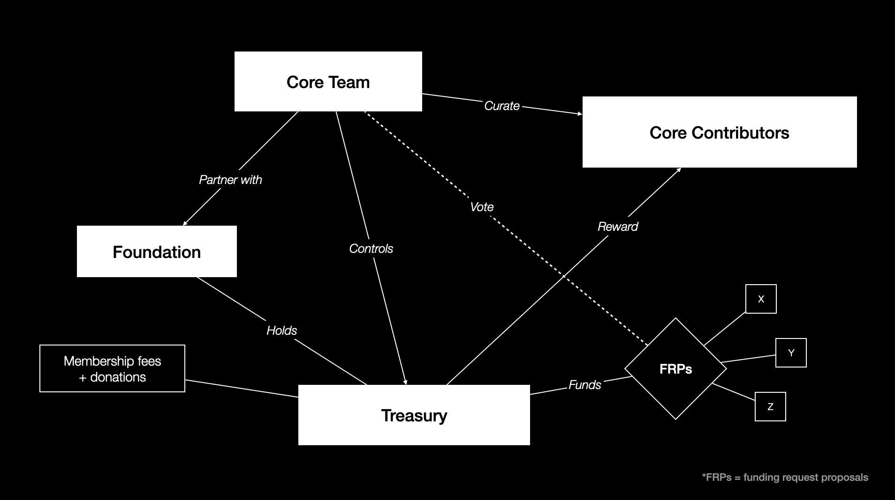
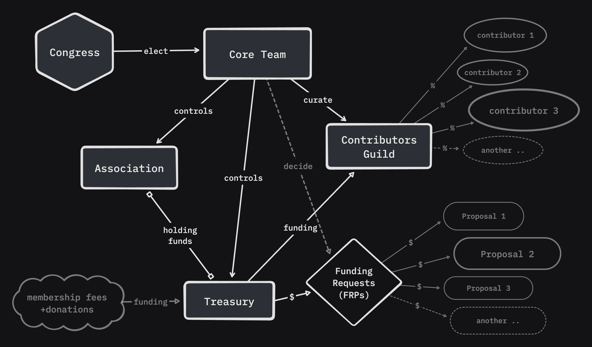

import { LinkCard } from '@astrojs/starlight/components';

# Note: this article is outdated / no longer valid

Over the past two years, we have experimented with different governance models. 
Below, we share our insights, highlighting our missteps to inspire others.

## 2024 

Anyone who assists in the completion of our projects and activities is considered a contributor. Frequent contributors have the chance to become [Core Contributors](/governance/core-contributors/) and receive rewards for their contributions to open source.

### Proof of Care - *become a Core Contributor*

The transition from contributors to [Core Contributors](/governance/core-contributors/) occurs through a Proof of Care: through continuous or substantial involvement, contributors demonstrate their interest and dedication to our [mission](/about-us/manifesto/). 

Core Contributors get rewarded for their contributions to open source - by the whole Web3Privacy Ecosystem. 

### Proof of Soul - *enter the Core Team*

To join the [Core Team](/governance/core-team/), a Proof of Soul is required. Through closer interaction with the core team, the most active core contributors who are committed to supporting the organization's values and advancing its mission can gradually become part of the decision-making process as they earn the credibility and trust of all core team members.

## 2023 

We attempted to establish different departments, a legal entity, and infrastructure to manage decision-making, handle treasury functions, and welcome new members, but these efforts were unsuccessful. In the future, we plan to pursue a similar path, but instead of forming an association, we will aim to create a foundation in Switzerland.

### Governance Units

*The Web3Privacy Now* initiative is composed of these basic governance units:

<LinkCard
  title="Congress"
  description="Top organ, votes on most important issues, elects Core Team/Association executives"
  href="/events/congress"
/>
<LinkCard
  title="Core Team"
  description="Main decision-making and executive body"
  href="/governance/core-team"
/>
<LinkCard
  title="Core Contributors"
  description="Group of members receiving incentives"
  href="/governance/core-contributors"
/>
<LinkCard
  title="Become a Contributor"
  description="How to contribute to the Web3Privacy Now project"
  href="/get-involved/index"
/>
<LinkCard
  title="Treasury"
  description="Fund management"
  href="/governance/treasury"
/>

### Personal roles within initiative

Sorted by competencies - from least to most.

| Role name | Competences | Transparency |
| --- | --- | --- |
| Guest / Visitor | none | 🔒 private |
| [Members](/get-involved/partnership) | none | 🔒 private |
| [Members](/get-involved/partnership) with voting rights | voting on the [congress](/events/congress) | 🔒 private |
| [Workgroup](/contributors/workgroups) member (*contributor*) | decision-making within the working group | 🔒 private |
| [Contributors Guild](/contributors/index) member* | receives financial compensation | 🥷 pseudonym (name, link) |
| Association Committee member* | operate with finances and curate [Contributors Guild](/contributors/index) | 👁️ public |
| [Core Team](/governance/core-team) member* | decides on the most important issues, controls Association | 🥷 pseudonym (name, link) |

\* - People with these roles automatically become [Members](/get-involved/partnership) with voting rights:
  - Contributors Guild members
  - Association Committee members
  - Core Team members
