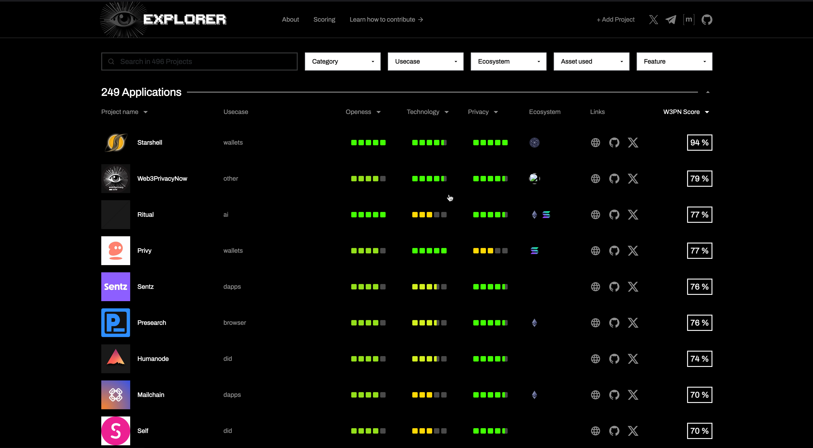

**3in1**: a ranking system, database & comprehensive profiling to empower the general public in discerning the privacy levels, security, and reliability of Web3 projects.

- Website [link](https://explorer.web3privacy.info)

**contributors**: Ethanolo, Juan, Coinmandeer, Develit, Mykola, Rsscono1, Mf

Despite the foundational role that privacy is meant to play in shaping Web3, genuinely impactful initiatives remain scarce. Many projects leverage the concept of privacy as a buzzword or for public relations advantage, rather than addressing tangible issues or enacting substantial changes at the infrastructural and transactional level.

That's why a ranking system of all privacy-related projects in Web3 could help a lot the users to discern and decide who to trust.

### Major update (10 October)
- [New front-end UI & UX ](https://explorer.web3privacy.info/)
- [New Editor](https://explorer.web3privacy.info/project/create) (Create New & Change project)
- [Over 500 projects added to explorer](https://github.com/web3privacy/explorer-data/tree/main/src/projects)
- [Updated scoring mechanism](https://mirror.xyz/0x0f1F3DAf416B74DB3DE55Eb4D7513a80F4841073/s9flkE6tMaJ4f2tzWu-FmDy7Zx_TRPe3jdXr2iYmYH0)
- [Updated and simplified schema](https://github.com/web3privacy/explorer-data/blob/main/sample-project.yaml)
- [Updated simplified readme.md ](https://github.com/web3privacy/explorer-data/blob/main/README.md)with instructions on how to add/or edit
- 
- Multiple articles published 
    - [Your time to shine light on Privacy](https://mirror.xyz/0x0f1F3DAf416B74DB3DE55Eb4D7513a80F4841073/-Vu8UYstwv1Br4XVTfoUYHFu24S77aezdSY4IM1FUV4)
    - [Explorer Scoring Mechanism breakdown](https://mirror.xyz/0x0f1F3DAf416B74DB3DE55Eb4D7513a80F4841073/s9flkE6tMaJ4f2tzWu-FmDy7Zx_TRPe3jdXr2iYmYH0)
    - [Edit your project on Explorer: How To](https://mirror.xyz/0x0f1F3DAf416B74DB3DE55Eb4D7513a80F4841073/Ri2ZMIq6Os-ZKQyT_l6a5F1-gJURySvvwNRKzBvNpWM)
    - [Add a project to Explorer: How to](https://mirror.xyz/0x0f1F3DAf416B74DB3DE55Eb4D7513a80F4841073/Ri2ZMIq6Os-ZKQyT_l6a5F1-gJURySvvwNRKzBvNpWM)
- [Implemented open-source project management system to fost transparency](https://github.com/orgs/web3privacy/projects/15)
- [Merged PRs](https://github.com/web3privacy/explorer-data/pulls?q=is%3Apr+is%3Aclosed)
- [New issue Ticket system](https://github.com/web3privacy/explorer-data/issues)
    

## Value

**General public**
- Find projects you can trust 
- Explore your privacy stack
- Compare projects’ privacy features
- Filter projects by scoring
- Filter projects by ecosystems
- Explore which projects match your use case (like “swap assets”)

**Devs**
- Explore projects delivering privacy
- Research on use-cases
- Improve existing solutions

**Security audit companies / white hackers**
- Find clients lacking security audit (privacy-focused)

**Investors**
- Explore early-stage projects
- Find outstanding builders
- Back critical privacy stack

##  About the Scoring Mechanism 
It incorporates both expert analysis and community input, to offer impartial resources for evaluating projects.

- Professional scoring would be a joint R&D with the key web3 people from protocol architects to security specialists. We are collecting feedbacks from privacy experts from the Ethereum Foundation, Railgun, Waku, NYM... 

- In parallel to the top-down scorecard method, we'll develop and implement a bottom-up community scoring platform too (think of Metacritic exters + users scorings) -> at the end of the day it's the users who have to become the real watchdogs of the industry, signaling about flaws and shortcomings of solutions.

We interviewed 100 privacy players & gathered an MVP vision — we are running a series of 1-on-1 feedback loop sessions to make the scoring model community validated.

[Have a read about how the current mechanism works here](https://mirror.xyz/0x0f1F3DAf416B74DB3DE55Eb4D7513a80F4841073/s9flkE6tMaJ4f2tzWu-FmDy7Zx_TRPe3jdXr2iYmYH0)

## References:
- [l2beat](https://l2beat.com/scaling/risk)
- [certik](https://www.certik.com/)
- [metacritic](https://www.metacritic.com/about-metascores)
- [Clutch](https://clutch.co/methodology)

## Research 
* **Design**: _Explorer UI_: [GitHub](https://github.com/web3privacy/web3privacy/blob/main/Web3privacynowplatform/UI/Readme.md), [V1.0](https://github.com/web3privacy/web3privacy/blob/main/Web3privacynowplatform/UI/Readme.md#v10-eth-rome-prototype),[V1.1](https://github.com/web3privacy/web3privacy/blob/main/Web3privacynowplatform/UI/Readme.md#v11-post-ethrome-update), [V 1.1 mobile](https://github.com/web3privacy/web3privacy/blob/main/Web3privacynowplatform/UI/Readme.md#v11-post-ethrome-update-mobile-version), [V1.2](https://github.com/web3privacy/web3privacy/blob/main/Web3privacynowplatform/UI/Readme.md#v12-post-ethrome-update-basic-scoring-x-brief-sync)
* **Research**: _Privacy Explorer breaf_: [Brief](https://github.com/web3privacy/web3privacy/blob/main/Web3privacynowplatform/Brief.md). Pull requests by [Railgun_](https://github.com/web3privacy/web3privacy/pull/31), [Waku](https://github.com/web3privacy/web3privacy/pull/35), [Lit](https://github.com/web3privacy/web3privacy/pull/34), [Brume](https://github.com/web3privacy/web3privacy/pull/38), [Webb](https://github.com/web3privacy/web3privacy/pull/37)
* **Research**: _Scoring matching: Brief, Non-techies validity, MVP_: [GitHub](https://github.com/web3privacy/web3privacy/blob/main/Web3privacynowplatform/scoringmodel/Data%20brief%20%26%20scoring%20model%20comparison.md)
* **Research**: _Privacy Explorer product features_: [GitHub](https://github.com/web3privacy/web3privacy/tree/main/Web3privacynowplatform/scoringmodel/Product%20features)
* **Research**: _Data Manifest for Privacy Explorer platform_: [GitHub](https://github.com/web3privacy/data/tree/main#readme)
* **Research**: _Privacy Explorer data survey_: [Typeform](https://gy0n92ttldn.typeform.com/to/clX8HhGi)

## Explorer Articles

All of our articles can be found on our [Mirror](https://mirror.xyz/0x0f1F3DAf416B74DB3DE55Eb4D7513a80F4841073), curious about the ones specifically about explorer? Check them out here:

- [Your time to shine light on privacy](https://mirror.xyz/0x0f1F3DAf416B74DB3DE55Eb4D7513a80F4841073/-Vu8UYstwv1Br4XVTfoUYHFu24S77aezdSY4IM1FUV4)
- [Explorer: Scoring mechanism breakdown](https://mirror.xyz/0x0f1F3DAf416B74DB3DE55Eb4D7513a80F4841073/s9flkE6tMaJ4f2tzWu-FmDy7Zx_TRPe3jdXr2iYmYH0)
- [Add a project to Explorer: How To](https://mirror.xyz/0x0f1F3DAf416B74DB3DE55Eb4D7513a80F4841073/Ri2ZMIq6Os-ZKQyT_l6a5F1-gJURySvvwNRKzBvNpWM)
- [Edit your project on Explorer: How To](https://mirror.xyz/0x0f1F3DAf416B74DB3DE55Eb4D7513a80F4841073/yDbRRq8FjSogK7iUWdiRKkm54wvx6DgRt99gFuineuY)
- [Building "l2beat for privacy" at ETHRome](https://mirror.xyz/0x0f1F3DAf416B74DB3DE55Eb4D7513a80F4841073/nVGxQjtLSabZe2Bkc7LZd5kGxW-C8-Rm2Se1AONqKZY)
- [~~Add your privacy project to explorer (old)~~](https://mirror.xyz/0x0f1F3DAf416B74DB3DE55Eb4D7513a80F4841073/Za8nrM7gQhVloDJNKjSPD1d0h2bQkjyehrBelRIT9Do)

## Milestones

| Area | Date | Link |
| ------------- | ------------- | ------------- |
| MVP | dec, 2023 | 1. Landing. 2. DeFi category scoring benchmark. 3. Easily upgradable Project data via GitHub. 4. Basic documentation. |
| QA | jan, 2024 | 1. Bug fixing. 2. Content update. 3. Content filled by the projects themselves |
| V1.0 | Feb, 2024 | 1. Category expansion (200 projects). 2. Scoring model major update (built by community). 2. Content update. 3. Content filled by the projects themselves (plus moderation). 5. Extended documentation. |
| V2.0 | March, 2024 | 1. [database](https://github.com/web3privacy/web3privacy) synchronization . 2. Content update (actualisation). 3. Content filled by the projects themselves (plus moderation). |
| [V3.0](#Major-update-10-October) | Oct, 2024 | 1. Front end UI/UX Update. 2. Scoring mechanism implementation & update. 3. Creation of Editor mode to create new and edit existing projects outisde of github 4. Creating new documentation 5. Content creation to push new projects to add data 6. Over 500 projects submitted 7.Transparent open-sourced project management system |

### Smaller updates:

### jun 24 update
-   [Merged PRs](https://github.com/web3privacy/explorer-data/pulls?q=is%3Apr+is%3Aclosed)
-   PRs from CultDAO, [Oasis Network](https://github.com/web3privacy/explorer-data/pull/609), [PSE](https://github.com/web3privacy/explorer-data/pull/632/commits/ac2cb864d86389b9be34fc2fd5759a73984c4d29)
-   Contribution guide has been published on [Mirror](https://mirror.xyz/0x0f1F3DAf416B74DB3DE55Eb4D7513a80F4841073/Za8nrM7gQhVloDJNKjSPD1d0h2bQkjyehrBelRIT9Do)
-   Fixed non-working [search](https://github.com/web3privacy/explorer-app/commit/68f73dc19d02c356ef7452e9390833a0ca9e62dd)
-   Sample project yaml [updated](https://github.com/web3privacy/explorer-data/blob/main/sample-project.yaml)

## Team
- Core project manager: Michiel (Mf) [GitHub](https://github.com/DeBelg), [Twitter](https://x.com/0x_m_f), [Site](https://michiel.degruytere.com)
- Research track: [Mykola Siusko](https://github.com/Msiusko), [PG](https://github.com/EclecticSamurai)
- Product Design: [Coinmandeer](https://github.com/coinmandeer), 
- Development: [Devlit team](https://develit.io/)

## Project Repositories
| Repository | Description |
| --- | --- |
| [@web3privacy/explorer](https://github.com/web3privacy/explorer) | [Privacy Explorer](/projects/privacy-explorer) project main repository |
| [@web3privacy/explorer-app](https://github.com/web3privacy/explorer-app) | [Privacy Explorer](/projects/privacy-explorer) application frontend |
| [@web3privacy/explorer-data](https://github.com/web3privacy/explorer-data) | Data repository for [Privacy Explorer](/projects/privacy-explorer) project |
| [@web3privacy/explorer-app](https://github.com/web3privacy/explorer-new-ui) | [Privacy Explorer](/projects/privacy-explorer) NEW application frontend |

