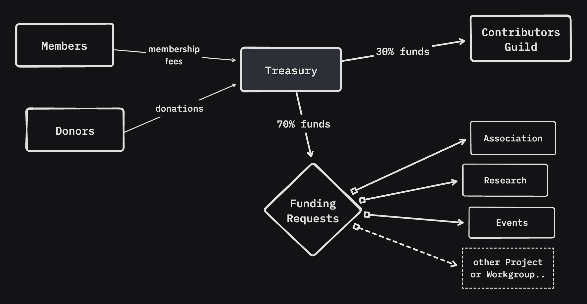

The Treasury is our main financial instrument that receives all of our income (from [membership fees](/membership) or [donations](/donate)) and redistributes these funds within our initiative.

The on-chain portion of the funds is managed through [Multi-sig wallet](/core-team/multisig), but Treasury also holds funds off-chain in fiat through the [Association](/association).

Treasury management is the responsibility of the [Core Team](/core-team).

## Distribution
* 30% automatically goes to [Contributors Guild](/guild), eq. directly to contributors
* the remaining 70% is distributed through [Funding Requests](http://localhost:4322/resources/funding#funding-requests-fr) to specific projects or Workgroups

